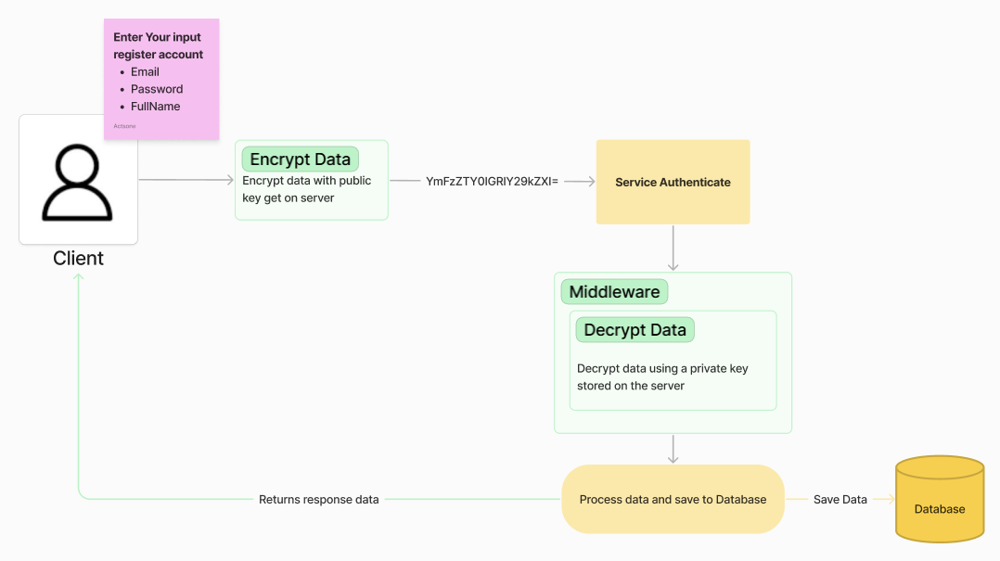
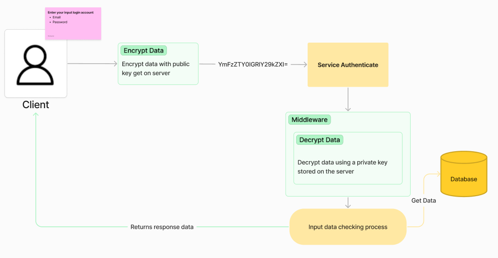
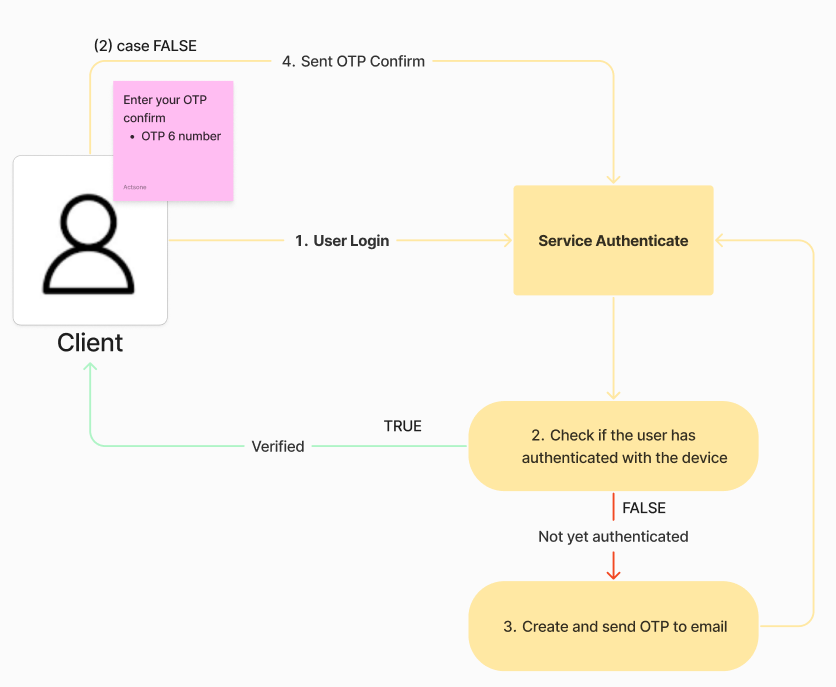

### Link Demo Open (9 AM -> 18 PM)
<a href="https://memoo.hanguyen.online" _blank>
https://memoo.ddnsking.com:9000
</a>

## Workflow: Sign-up Account
- Sử dụng cơ chế mã hóa bất đối xứng <b>(asymmetric encryption)</b> với 2 khóa, khóa public chỉ để mã hóa dữ liệu không thể thực hiện giải mã, và server giữ khóa private dùng để mã hóa dữ liệu với public ở client. 

## Workflow: Sign-in Account
- Cơ chế tương đương với phần đăng ký -> giúp bảo toàn dữ liệu của user khi truyền tải qua internet, hạn chế việc bị lộ thông tin nhạy cảm như (Password, Email,...).

## Workflow: (Two-Factor Authentication - 2FA)
- Sử dụng phương pháp xác thực 2 bước để bảo mật cho cả hệ thống và user đang sử dụng hệ thống.
- Tầng 1: Xác thực tài khoản (Username, Password)
- Tầng 2: OTP confirm (được gửi qua email đăng ký của user)

